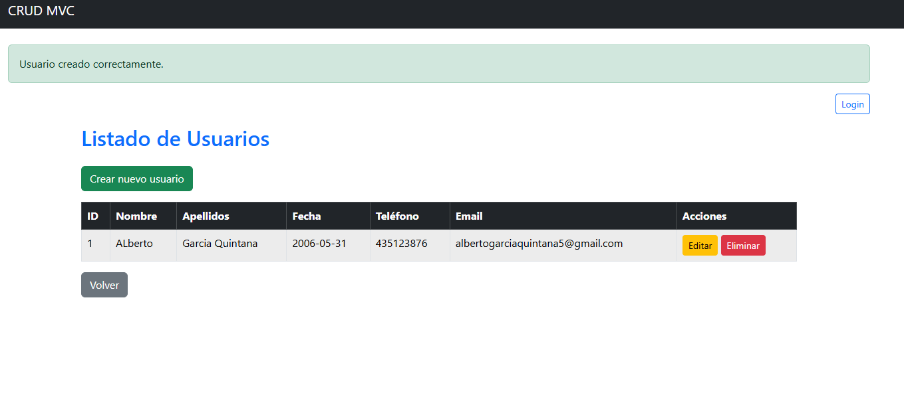
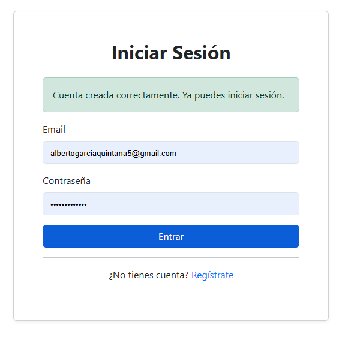
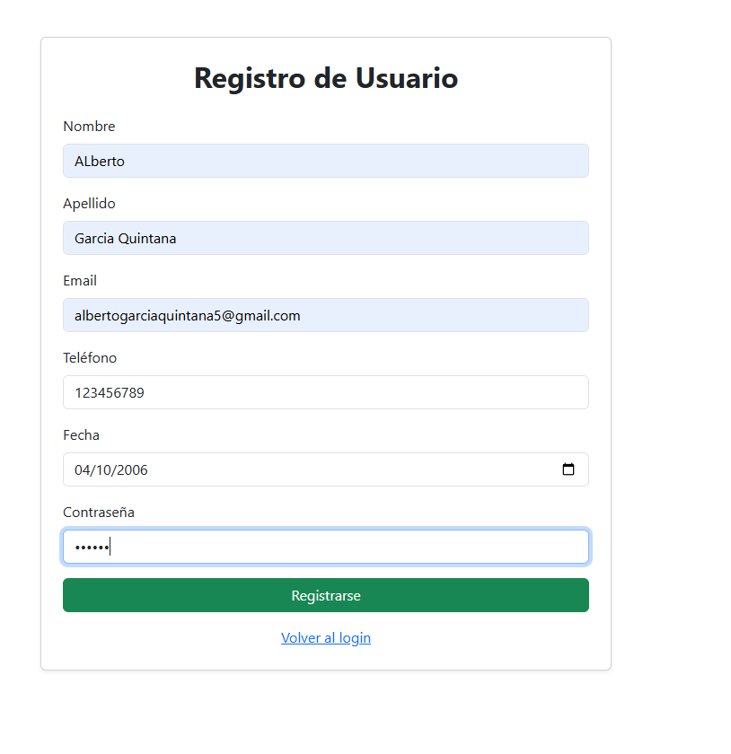
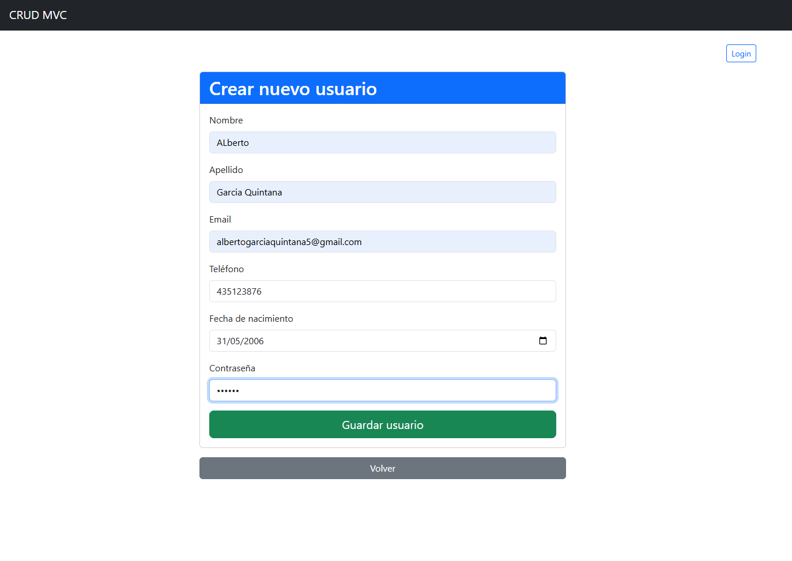
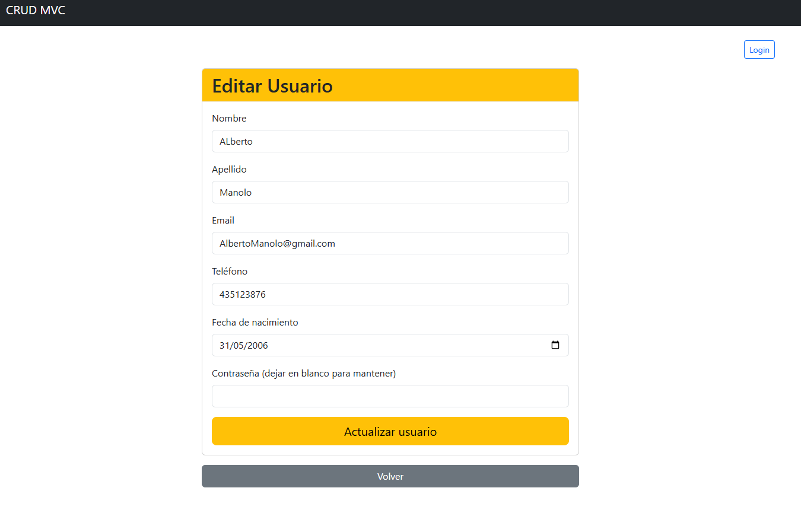
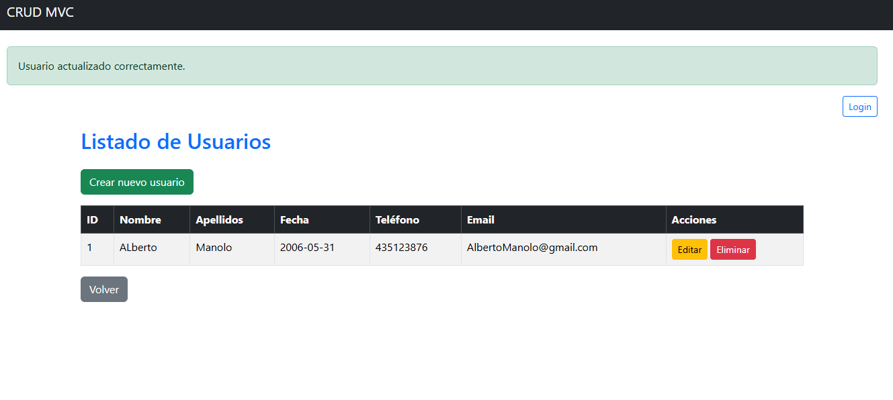
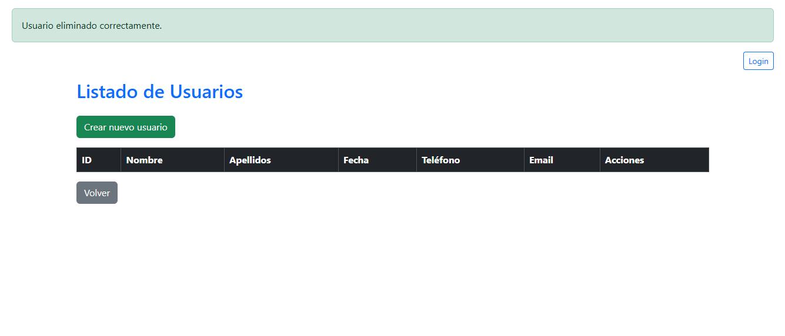

Características:

Conexión a MySQL con PDO
Modelo User con métodos all, find, create, update, delete
Controlador UserController con acciones index, create, store, edit, update, delete
Vistas separadas en app/views/users
Validación básica y uso de password_hash
Código comentado y sin dependencias externas

<div align="center">
	<h1>CRUD Básico en PHP (MVC + PDO)</h1>
	
</div>

## ✨ Descripción
Este proyecto es un CRUD básico de usuarios desarrollado en PHP siguiendo el patrón MVC y utilizando PDO para la conexión a MySQL.

Incluye:
- Conexión segura a MySQL con PDO
- Modelo `User` con métodos: all, find, create, update, delete
- Controlador `UserController` con acciones: index, create, store, edit, update, delete
- Vistas separadas en `app/views/users`
- Validación básica y uso de `password_hash`
- Código comentado y sin dependencias externas

## 🚀 Instalación y uso

1. **Clona el repositorio** en tu servidor local (XAMPP, Laragon, etc).
2. **Importa la base de datos**:
	 - Ve a la carpeta `migrations` y usa el archivo `ejecutarsql.sql` para crear la base de datos y la tabla necesaria.
	 - Puedes importarlo desde phpMyAdmin o usando la consola de MySQL:
		 ```bash
		 mysql -u tu_usuario -p < migrations/ejecutarsql.sql
		 ```
3. **Configura la conexión a la base de datos** en el archivo correspondiente dentro de `mvc/config/` si es necesario.
4. Accede al proyecto desde tu navegador, por ejemplo: `http://localhost/dwes-crud-basico/`


## 🖼️ Capturas de pantalla

### Login
Pantalla de inicio de sesión donde los usuarios pueden acceder al sistema introduciendo su correo y contraseña.


### Registro
Formulario para crear una nueva cuenta de usuario, solicitando los datos básicos necesarios.


### Lista de usuarios
Vista principal donde se muestran todos los usuarios registrados en la base de datos, con opciones para editar o eliminar cada uno.


### Crear usuario
Formulario para añadir un nuevo usuario al sistema, completando los campos requeridos.


### Editar usuario
Permite modificar los datos de un usuario existente. Tras guardar los cambios, se muestra un mensaje de éxito.



### Eliminar usuario
Opción para borrar un usuario de la base de datos de forma permanente.


## 📁 Estructura del proyecto

```
dwes-crud-basico/
│
├── migrations/           # Scripts SQL para la base de datos
├── mvc/                  # Código fuente MVC
│   ├── app/
│   │   ├── controllers/
│   │   ├── models/
│   │   └── views/
│   └── config/
├── *.png                 # Imágenes de ejemplo
├── index.php             # Entrada principal
└── README.md
```

## 📝 Autor

Alberto García Quintana

---
¡Si te resulta útil, no dudes en dejar una estrella en el repositorio!
